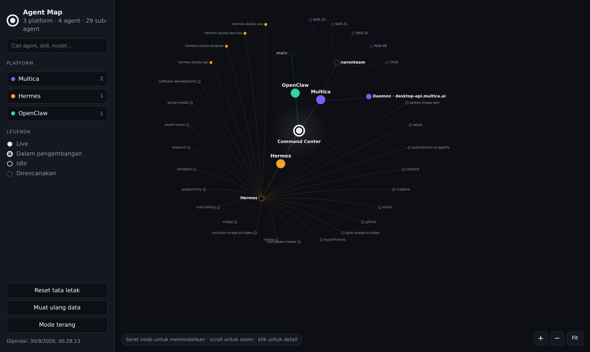
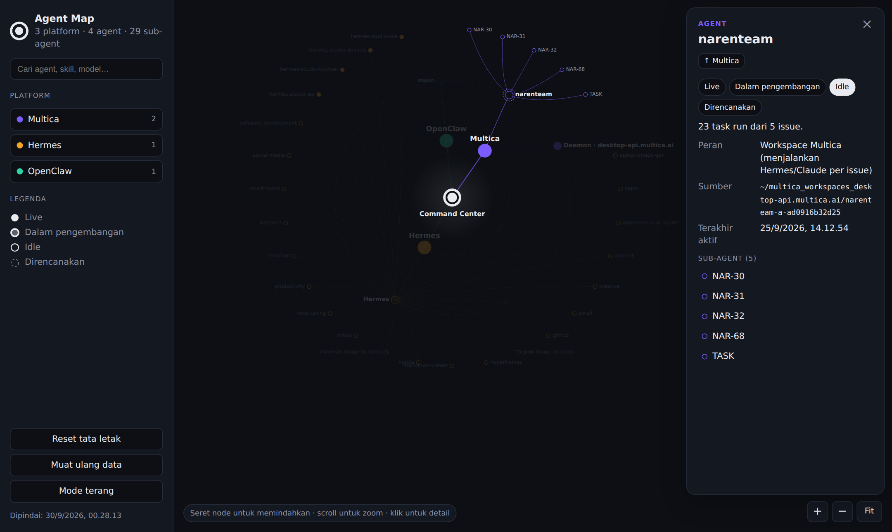
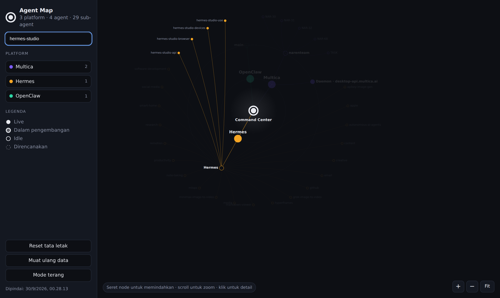
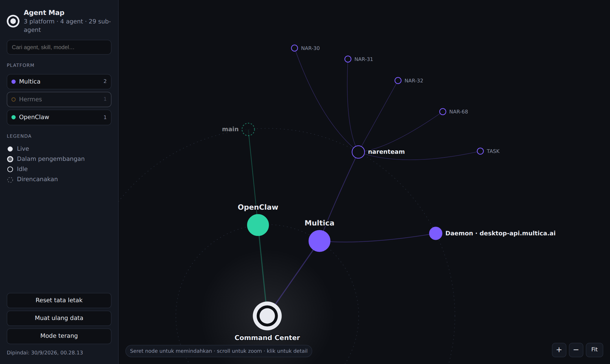
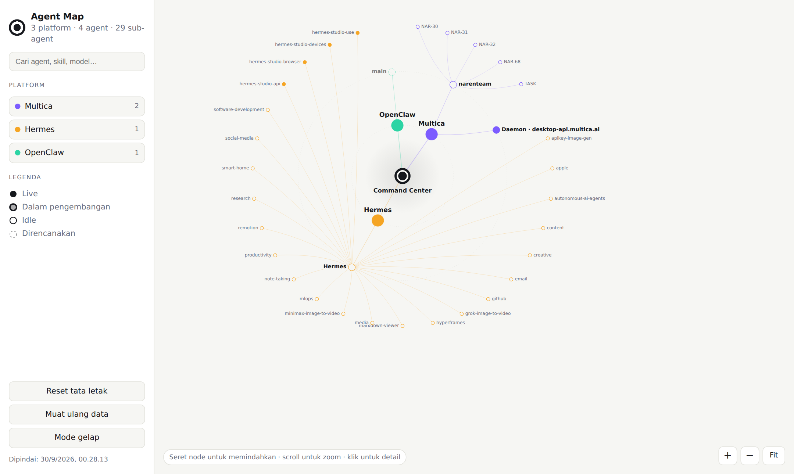

# Agent Map

Radial map (gaya SkillTree) untuk semua agent & sub-agent: Multica, Hermes, Claude, OpenClaw.



## Tampilan

| Panel detail agent | Pencarian |
|---|---|
|  |  |
| Klik node untuk melihat peran, sumber, sub-agent, dan menandai status. | Node yang tidak cocok meredup, cabang induknya tetap terlihat. |

| Filter platform | Mode terang |
|---|---|
|  |  |
| Sembunyikan platform lewat chip di sidebar; peta otomatis di-fit ulang. | Tema mengikuti sistem, bisa diganti manual. |

> Screenshot diambil dari hasil scan config lokal asli (3 platform, 4 agent, 29 sub-agent).

## Menjalankan

```
npm install
npm run dev        # scan config -> public/agents.json -> buka http://localhost:5173
npm run scan       # hanya pindai ulang
npm run build      # produksi (dist/)
```

## Cara kerja
- `scripts/scan.mjs` membaca struktur config lokal (nama, skill, MCP, run) — **tidak** membaca token/kunci — lalu menulis `public/agents.json`.
- Frontend (`src/`) hanya membaca `agents.json`: Pusat → Platform → Agent → Sub-agent.
- Node bisa di-drag (parent membawa anaknya), scroll = zoom, klik = detail + tandai status (Live / Dev / Idle / Direncanakan, disimpan di browser).

## Sumber & path
Default: `~/.hermes`, `~/.multica`, `~/multica_workspaces_desktop-api.multica.ai`, `~/ai-agents/agent_setups`, `~/.claude`.
Ubah lewat `agentmap.config.json`:

```json
{ "title": "Agent Map", "rootName": "Command Center",
  "hermes": "~/.hermes", "claude": "~/.claude",
  "extraClients": [{ "id": "x", "name": "X", "color": "#0af",
    "agents": [{ "id": "x1", "name": "Agent X", "status": "live",
      "subagents": [{ "id": "x1a", "name": "Sub A", "status": "idle" }] }] }] }
```

`agents.json` bisa juga ditulis tangan/dari API Multica: cukup penuhi skema di atas.

## Langkah lanjut
Data live dari API Multica (agent server-side), status realtime via SSE, dan tampilan per-issue.
